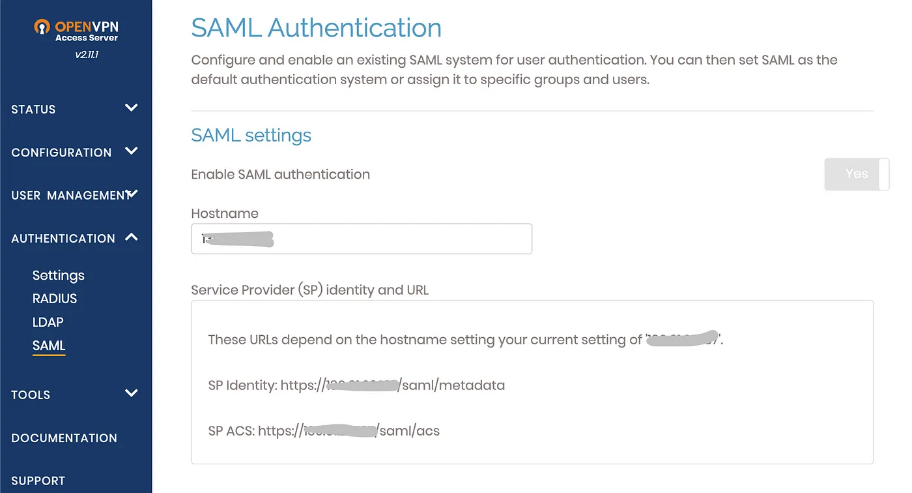
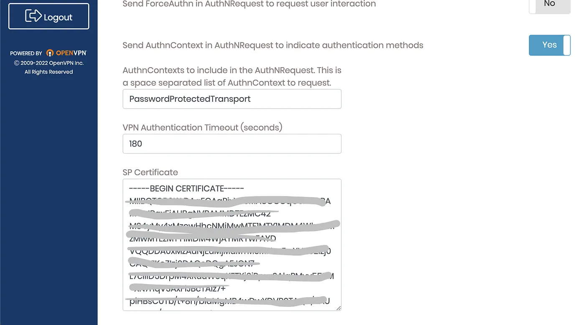
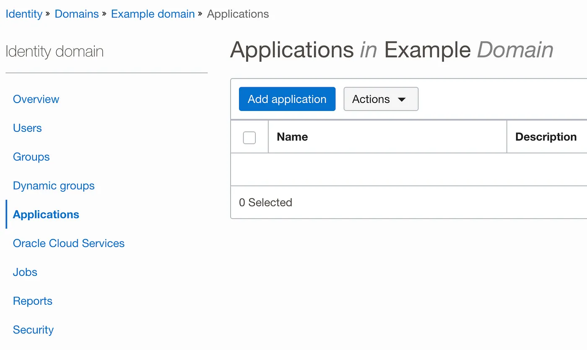

La gestione dell'identità e dell'accesso è un obiettivo cruciale in un'organizzazione in crescita.

Oltre all'esigenza di semplificare la gestione degli utenti e migliorare la sicurezza, l'integrazione con servizi esterni sta diventando sempre più rilevante.

Oracle OCI offre un servizio completo per la gestione dell'identità e dell'accesso chiamato [IAM with Identity Domains](https://docs.oracle.com/en-us/iaas/Content/Identity/home.htm).

> Nel dettaglio:

> Un dominio dell'identità è un contenitore per la gestione degli utenti e dei ruoli, la federazione e l'approvvigionamento degli utenti, l'integrazione sicura delle applicazioni attraverso la configurazione dell'Oracle Single Sign-On (SSO) e l'amministrazione dell'Identity Provider basata su SAML/OAuth. Rappresenta un insieme di utenti in Oracle Cloud Infrastructure e le relative configurazioni e impostazioni di sicurezza (come MFA).

> In questo post, esaminiamo come possiamo integrare l'autenticazione con MFA con un serer di accesso OpenVPN utilizzando IAM Identity domain di OCI.

> Per ridurre la complessità dello scenario, gli utenti e le password vengono creati direttamente su un IAM Domain senza integrazione degli utenti su directory esterne.

> Abbiamo già creato l'istanza per l'appliance OpenVPN sul [OCI Compute](https://docs.oracle.com/en-us/iaas/Content/Compute/home.htm).

Il primo passo e' creare il domino su IAM service, o usarne uno esistente da **Identity & Security -> Domains**

Segui i moduli e inserisci i tuoi dettagli dell'account principale. Dopo alcuni secondi, la directory viene creata con il tuo utente come primo utente creato.

Dovrai ottenere alcuni dati dalla console di amministrazione di OpenVPN e conservarli in un luogo sicuro.

Salva l'Identity SP e l'ACS SP dalla sezione SAML della console web di amministrazione di OpenVPN.

e copia il certificato SP in un file locale denominato certificate.pem dalla stessa pagina.

Per integrare il server di accesso OpenVPN, è ora necessario aggiungere un'applicazione di dominio da un modulo dell'applicazione.

e scegli SAML application:

Aggiungi il nome e, opzionalmente, l'icona personalizzata e premi Avanti; tutte le altre opzioni sono facoltative.

Inserisci ID Entità, URL del consumatore di asserzioni e carica il file certificate.pem salvato in precedenza, quindi premi il pulsante Fine.

Scarica il file di metadati IdP dal pulsante dominio dell'identità IAM.

e carica il file di metadati scaricato dal dominio dell'identità IAM nella sezione IdP della pagina SAML di OpenVPN.

La configurazione SAML è completa!

Ricordati di attivare l'autenticazione SAML nella sezione OpenVPN.

Ora puoi provare l'autenticazione SAML dalla pagina web di OpenVPN.
